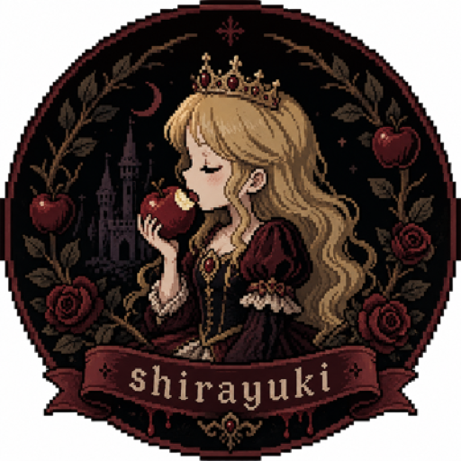

# shirayuki

<p align="center">
  
</p>

KittyMemory-inspired memory toolkit for jailbroken iOS. Theos tweak with in-app overlay GUI.

---

## Features

| Category | Details |
|----------|---------|
| **Memory R/W** | Mach VM API, auto page-protection save/restore, typed read/write |
| **Pattern Scan** | IDA-style with `??` wildcards, anchor-byte skip optimization |
| **Value Scan** | i8/i16/i32/i64/u8/u16/u32/u64/f32/f64 |
| **Narrowing** | Changed / Unchanged / Increased / Decreased / Exact filter |
| **Patch** | Apply/restore with backup, NOP sled (ARM64), per-patch toggle |
| **Freeze** | Lock values at 60fps, per-entry pause, conditional triggers |
| **Watchpoint** | Real-time value monitor with change counter |
| **Pointer Scan** | Recursive chain finder, ASLR-independent, configurable depth |
| **Disassembly** | Built-in ARM64 decoder (B/BL/B.cond/MOV/STP/LDP/RET/NOP) |
| **Session** | Save/load bookmarks, patches, freezes, pointer chains to JSON |
| **Overlay GUI** | Floating panel, dark+cyan theme, SF Symbols, 6 tabs, drag-to-move |
| **Toast** | In-app notifications with haptic feedback |
| **Symbol Lookup** | dlsym-based symbol resolution from loaded images |

---

## GUI Tabs

| Tab | Function |
|-----|----------|
| **Search** | Scan by type (i32/f32/i64/etc), narrow with filter buttons, batch modify, tap to write/freeze/watch |
| **Patch** | Hex patch at address, toggle on/off, restore original, swipe to delete |
| **Freeze** | Lock address to value (supports i32/f32/f64/i64), tap to pause, conditional threshold mode |
| **Watch** | Monitor addresses in real-time, track change count, auto-refresh |
| **Ptr** | Pointer chain scan with configurable depth/offset, validate & copy |
| **Dump** | Hex dump or ARM64 disassembly (`0xADDR asm`), long-press to NOP |

---

## Project Structure

```
shirayuki/
├── Makefile
├── Shirayuki.plist
├── ShirayukiMemory/
│   ├── ShirayukiMemory.hpp/cpp    — Core (read/write/scan/patch/disasm)
│   ├── Freeze.hpp/cpp             — Value freeze + conditional triggers
│   ├── Watchpoint.hpp/cpp         — Real-time value monitor
│   ├── PointerScan.hpp/cpp        — Pointer chain scanner
│   └── Session.hpp/mm             — JSON session persistence
├── GUI/
│   ├── SYTheme.h/m                — Colors, fonts, icons
│   ├── SYResultCell.h/m           — Card-style table cell
│   ├── SYDragButton.h/m           — Floating toggle (edge-snap, haptic)
│   ├── SYToast.h/m                — Toast notifications
│   ├── SYTabHandler.h             — Tab handler protocol
│   ├── ShirayukiWindow.h/m        — Overlay UIWindow
│   ├── ShirayukiViewController.h/m — Main panel (handler-based)
│   └── Handlers/
│       ├── SYSearchHandler.h/mm   — Search + narrowing + batch
│       ├── SYPatchHandler.h/mm    — Hex patching
│       ├── SYFreezeHandler.h/mm   — Freeze management
│       ├── SYWatchHandler.h/mm    — Watchpoints
│       ├── SYPointerHandler.h/mm  — Pointer scan
│       └── SYDumpHandler.h/mm     — Hex dump + disassembly
├── Tweak/
│   └── Tweak.xm                   — Entry point
└── layout/DEBIAN/control
```

---

## Quick Start

```bash
# 1. Set target bundle in Shirayuki.plist
# 2. Build and install
make package install

# 3. Open target app, tap the floating snowflake button
```

---

## Programmatic API

```cpp
using namespace Shirayuki;

// Image + pattern scan
auto img = Image::find("UnityFramework");
auto hits = Scanner::findPatternInImage(img, "FF 43 01 D1 ?? ?? ??");

// Patch
auto p = Patch::createNop(Image::absoluteAddress(img, 0x123456), 2);
p.apply();

// Value search + narrowing
auto results = Scanner::findValue<int32_t>(region.start, region.size, 100);
auto narrowed = Scanner::narrowResults(candidates, ValueType::Int32, CompareMode::Decreased);

// Freeze (unconditional)
FreezeManager::shared().addValue<float>(addr, 99999.0f);
FreezeManager::shared().start();

// Freeze (conditional: write when value > threshold)
int32_t threshold = 50;
FreezeManager::shared().addConditional(addr, &maxVal, 4, ValueType::Int32,
    CompareMode::GreaterThan, &threshold, 4, [](uint64_t id, uintptr_t a) {
        NSLog(@"Triggered!");
    });

// Watchpoint
WatchManager::shared().add(addr, ValueType::Float32);
WatchManager::shared().setCallback([](const WatchEntry &e) {
    NSLog(@"Changed: %s", WatchManager::formatValue(e).c_str());
});
WatchManager::shared().start();

// Pointer scan
PointerScanConfig cfg;
cfg.targetAddress = addr;
cfg.maxDepth = 3;
auto chains = PointerScanner::scan(cfg);
// chains[0].resolve() gives runtime address

// Disassembly
auto insns = Disasm::disassemble(addr, 10);

// Symbol lookup
uintptr_t sym = Image::findSymbol("UnityFramework", "_il2cpp_class_from_name");

// Session save/load
Session session;
session.name = "my_cheats";
SessionManager::save(session, SessionManager::autoSavePath("com.example.app"));
```

---

## Requirements

- Jailbroken iOS 15.0+ (arm64)
- [Theos](https://theos.dev)
- Substrate or Substitute

---

## Disclaimer

For security research, CTF challenges, and educational use on devices you own.
